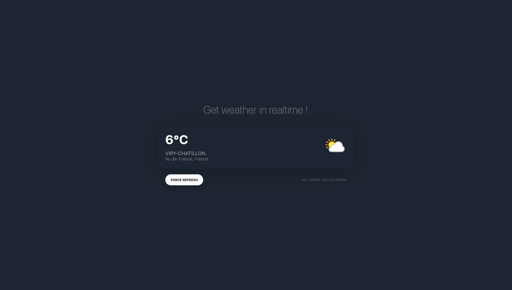

  
# React Weather Station App



Get weather in realtime !

This is my first React App that I developed to learn this framework.

## Before starting

This app uses a specific [weather API](https://weatherapi.com) where you need to generate an API Key.

After, you edit ```utilities > url-builder.js``` file and enter the generated key.

## How it works ?

When you open the app, you are automatically geolocated. The API provides weather information based on your location (latitude and longitude).

Weather infos refreshe every minute but you can force the loading by clicking on the "Force refresh" button.